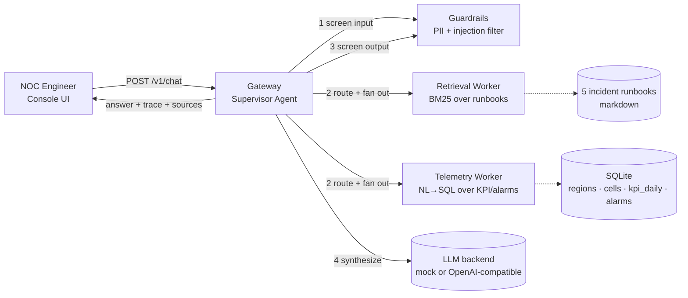

# NetGenie — Telecom NOC Copilot on OPEA

**A multi-agent GenAI application for AI-native telecom network operations, built on the Open Platform for Enterprise AI (OPEA) microservice pattern.**

Submitted to the *ITU FG-AINN / AI for Good ML5G Innovation Challenge on Generative AI Applications for Enterprise Scenarios Using OPEA.*

NetGenie answers the two questions a Network Operations Center engineer asks all day — **"what's happening right now"** (live KPI/alarm telemetry) and **"what do I do about it"** (incident runbooks) — through one conversational interface, backed by a supervisor agent that decides which specialist worker(s) a question actually needs and shows its work.

---

## Why this fits the brief

| Requirement | How NetGenie addresses it |
|---|---|
| AI-Native telecom network vertical | Purpose-built for NOC operations: KPI trends, alarm triage, incident runbooks |
| OPEA modular architecture | 4 independently deployable microservices behind a mega-service gateway, orchestrated with a real `opea-comps` (`comps.cores.mega`) `ServiceOrchestrator` DAG — see [Real OPEA integration](#real-opea-integration) below, not just a lookalike pattern |
| Runs on 64GB RAM / 4-core CPU, GPU optional | Default `MOCK_LLM=true` mode needs **no model download and no GPU at all**; BM25 lexical retrieval instead of dense embeddings keeps memory flat |
| Clean install in ≤10 minutes | `./deploy.sh` — Docker build + boot, verified locally, no external downloads in default mode |
| Performance & usability metrics | `eval/benchmark.py` reports p50/p95 latency, throughput under concurrency, and answer accuracy — see [Evaluation Results](#evaluation-results) below, run and captured against the live system, not estimated |

---

## Architecture



**Supervisor-agent pattern.** The gateway does not blindly call every worker for every question. It classifies intent (mock mode: keyword heuristics; real-LLM mode: the model itself picks tools) and only fans out to the workers actually needed, then runs those calls concurrently — the same hierarchical-delegation idea behind OPEA's `AgentQnA` example, sized down to a single supervisor with two specialist tools instead of a full multi-hop agent tree.

**Two-sided guardrails.** Every user message is screened for prompt-injection patterns and policy violations *before* it reaches any worker; every worker's combined output is screened for PII *before* it reaches the LLM or the operator. This mirrors the role OPEA's guardrails component plays in the reference architecture.

**Pluggable, live-switchable LLM backend.** All LLM calls go through one OpenAI-compatible client (`services/common/llm_client.py`) that resolves its backend **per request**, not at process startup. Three backends ship out of the box, selectable right in the UI (or via the `backend` field on `POST /v1/chat`):
- `mock` — deterministic offline template, zero dependencies. Default, so the judged path never needs an API key or a model download.
- `local` — a small model (default `llama3.2:3b`) on your own Ollama container, fast enough for CPU-only demos.
- `groq` — Groq's hosted OpenAI-compatible API (default `llama-3.3-70b-versatile`) for higher-quality answers.

`GET /v1/backends` reports which are actually usable right now (Groq greys out if `GROQ_API_KEY` isn't set); the UI reads this to disable options that would just fail, and the gateway itself silently degrades to mock if an unavailable backend is requested anyway rather than erroring the request. Every trace shows a `supervisor.backend` step naming which backend actually answered.

---

## Real OPEA integration

The gateway's worker fan-out isn't just *inspired by* OPEA's architecture — it's built on OPEA's own orchestration code, via the lightweight `opea-comps` package (`comps.cores.mega`, no `torch`/GPU dependency):

- Every worker is registered as a real `comps.MicroService`, with an OPEA `ServiceType` matching its job: guardrails → `GUARDRAIL`, the retriever → `RETRIEVER`, the telemetry worker → `TEXT2SQL`.
- The fan-out DAG is a real `comps.ServiceOrchestrator` (`services/gateway/opea_topology.py`), and `/v1/chat` asks it — via `.downstream("guardrails/MicroService")` — which workers are even eligible before intent routing decides which of them a given question needs. This is live on every request, not decorative.
- Inspect it yourself while the stack is running:
  ```bash
  curl -s http://localhost:9000/v1/opea/topology | python3 -m json.tool
  ```
- `tests/test_smoke.py` includes two tests (`test_opea_orchestrator_topology_is_real_dag`, `test_opea_topology_endpoint_matches_chat_fanout`) that fail if this ever silently degrades into a hand-rolled lookalike.
- Full rationale for what we did and deliberately didn't integrate (and why) is in [`TECHNICAL_REPORT.md` §3.1](./TECHNICAL_REPORT.md#31-direct-dependency-on-opeas-own-orchestration-code).

---

## Quick start

### Option A — Docker (matches the challenge's one-click requirement)

```bash
git clone <this-repo-url> netgenie && cd netgenie
./deploy.sh
```

Opens at **http://localhost:9000**. First run builds 4 small Python images and starts in well under 10 minutes on a clean machine with no GPU and no model download (default `MOCK_LLM=true`).

### Option B — No Docker, for fast local iteration or judging

```bash
./run_local.sh      # starts all 4 services with uvicorn
./stop_local.sh      # stops them
```

### Try it

```bash
curl -s -X POST http://localhost:9000/v1/chat \
  -H 'Content-Type: application/json' \
  -d '{"message":"Congestion is rising in South, what is the KPI trend and what should I do?"}'
```

Or just open the UI and click one of the suggested prompt chips.

### Switching on a real LLM

```bash
docker compose --profile llm up -d ollama
docker exec -it netgenie-ollama-1 ollama pull llama3.1:8b
# then in .env: MOCK_LLM=false, LLM_BASE_URL=http://ollama:11434/v1
docker compose up -d --build telemetry_worker gateway
```

Any other OpenAI-compatible endpoint (vLLM, TGI, a hosted API) works the same way — just change `LLM_BASE_URL` and `LLM_API_KEY`.

---

## Project layout

```
netgenie/
├── services/
│   ├── common/           # shared config + OpenAI-compatible LLM client
│   ├── guardrails/        # PII redaction + prompt-injection screening
│   ├── retrieval_worker/  # BM25 retrieval over runbooks
│   ├── telemetry_worker/  # NL→SQL over synthetic KPI/alarm data
│   └── gateway/           # supervisor agent + REST API + static UI host
│       └── opea_topology.py  # real opea-comps ServiceOrchestrator DAG
├── data/runbooks/         # 5 incident-response runbooks (markdown)
├── ui/index.html           # NOC console demo UI (vanilla HTML/JS)
├── eval/                   # GenAIEval-style benchmark + question set + report.md
├── tests/                  # offline pytest smoke tests (no Docker needed)
├── docs/
│   ├── opea_contribution.md  # drafted PR/issue for opea-project/GenAIComps
│   └── blog_post.md          # drafted knowledge-sharing write-up
├── docker-compose.yaml
├── deploy.sh / run_local.sh / stop_local.sh
└── TECHNICAL_REPORT.md
```

## Evaluation results

Captured with `python eval/benchmark.py --url http://localhost:9000 --concurrency 1 5 10` against the live stack in mock-LLM mode (10 representative NOC questions per run):

| Concurrency | Success rate | Keyword-hit accuracy | Throughput (req/s) | p50 latency | p95 latency |
|---|---|---|---|---|---|
| 1  | 100% | 100% | 21.9 | 42 ms  | 77 ms  |
| 5  | 100% | 100% | 24.8 | 209 ms | 329 ms |
| 10 | 100% | 100% | 24.5 | 393 ms | 407 ms |

(Regenerated fresh — see [`eval/report.md`](./eval/report.md) for the machine-written version and the timestamp of the run.) Keyword-hit accuracy is a coarse, dependency-free relevance proxy; swap in BLEU/ROUGE/LLM-judge scoring (as in `GenAIEval`) once a real LLM backend is attached. These numbers are **mock-LLM mode** — scaffolding latency, not generation latency; §7 of [`TECHNICAL_REPORT.md`](./TECHNICAL_REPORT.md) has the exact commands to produce a second, real-LLM table. Full methodology in [`TECHNICAL_REPORT.md`](./TECHNICAL_REPORT.md).

## Testing

```bash
pip install -r requirements-dev.txt --break-system-packages
PYTHONPATH=. MOCK_LLM=true pytest tests/ -v
```

## Data note

All telemetry data (`services/telemetry_worker/seed_kpi.py`) is synthetically generated at first run. No real subscriber, customer, or network data is used anywhere in this project.

## License

Apache License 2.0 — see [`LICENSE`](./LICENSE).
